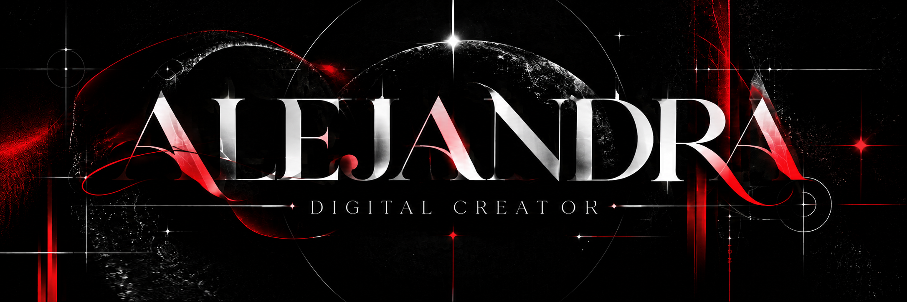

  

 

  

 

---

<h3 align="center">ABOUT ME</h3>

  Digital Creation student at Universidad El Bosque.
   
  Interested in UX/UI, visual design and digital experiences.

 

---

<h3 align="center">TECHNOLOGIES</h3>

 

 

---

<h3 align="center">SELECTED WORK</h3>

 

---

 

  GOOD IDEAS TAKE TIME.

